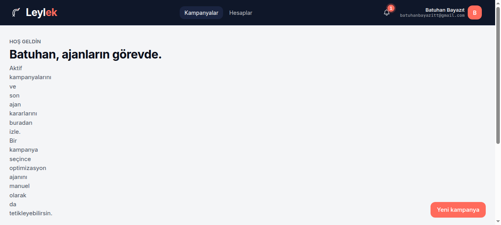
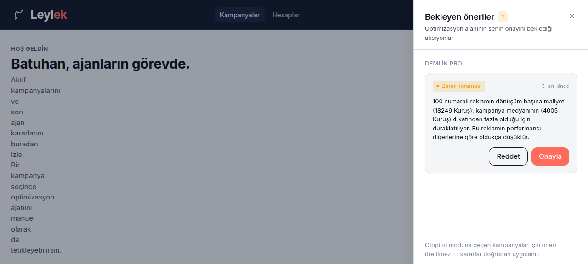
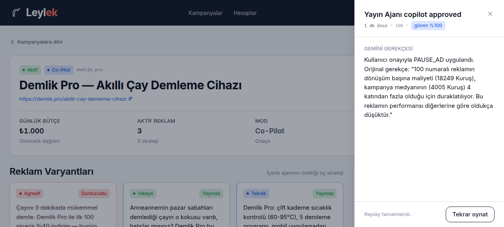
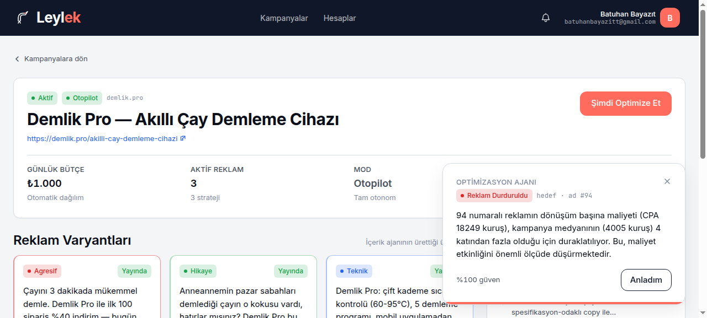

# Leylek

> **Müşteriyi Leylek getirir.** Siz uyurken satış yapan, zararı kesen otonom dijital pazarlama ajansınız.

[](https://github.com/NexVar/leylek/actions/workflows/ci.yml)
[](https://leylek.nexvar.io)
[](https://github.com/NexVar/leylek/releases/tag/v1.1.0)

Cloudflare üzerinde tamamen serverless çalışan **multi-agent yapay zekâ platformu**. KOBİ ve e-ticaret satıcıları için Meta Ads + Google Ads kampanyalarını otonom üretir, yayınlar ve optimize eder; zarar eden reklamı kapatır, bütçeyi kâr edene kaydırır.

İki çalışma modu:

- **Otopilot** — Tam otonom. Ajan kendi karar verir, eyleme geçer, log tutar.
- **Co-Pilot** — İnsan onaylı. Ajan önerir, kullanıcı uygulamadan veya e-postadan onaylar, ajan yürütür.

## Canlı

| | URL |
|---|---|
| Uygulama | <https://leylek.nexvar.io> |
| Sağlık probe (7 worker) | <https://leylek.nexvar.io/api/health> |

Single-origin: frontend Pages'tan, `/api/*` Worker route üzerinden gateway'e — aynı host, `SameSite=Lax` cookie.

## Ne yapıyor — 4 ekranda özet

| | |
|---|---|
|  | **Dashboard.** Kampanya listesi, aktif sayım, kullanıcı menüsü. Header'da bekleyen Co-Pilot önerisi sayısı bell badge ile düşer. |
|  | **In-app Co-Pilot inbox.** Cross-campaign pending proposals kampanya hostname'ine göre gruplanır. Onayla → publisher-agent gerçek aksiyonu uygular. |
|  | **Karar replay.** Geçmiş bir ajan kararına tıklayınca Gemini'nin Türkçe gerekçesi yeniden oynatılır — typewriter animasyonu + güven yüzdesi + Gemini request id. |
|  | **Kampanya detay.** 3 reklam varyantı (Agresif / Hikaye / Teknik), 48 saatlik harcama eğrisi, ajan timeline'ı, "Şimdi Optimize Et" CTA. |

## Mimari

Tamamen serverless — hiçbir sunucu kiralanmadı.

| Katman | Teknoloji |
|---|---|
| Frontend | React 19 + Vite 8 + Tailwind v4 (CSS-first `@theme`) — Cloudflare Pages |
| Backend (7 Worker) | Cloudflare Workers + Hono v4, Service Bindings ile haberleşir |
| Per-campaign state | Cloudflare Durable Objects (her kampanya kendi "yaşayan ajanı") |
| Veritabanı | Cloudflare D1 (serverless SQLite) + Drizzle ORM |
| Cache & session | Cloudflare KV |
| AI | Google Gemini 2.5 Flash (`responseSchema` ile structured output) |
| Reklam API'leri | Google Ads REST v17 + Meta Marketing API v21.0 — sandbox'ta `leylek-google-ads-mock` / `leylek-meta-ads-mock` Worker'ları, prod'da `googleads.googleapis.com` / `graph.facebook.com` (tek code path, `*_BASE_URL` env switch) |
| Auth | Google OAuth 2.0 (ana) + Magic-link via Resend (yedek) |
| CI/CD | GitHub Actions — typecheck + lint + build + 7-worker deploy + Pages deploy on push to main |

### 7 Worker + 1 Durable Object

```
React (Pages) ──── /api/* ────► gateway
                                  │
                                  ▼  Service Bindings (internal, no public URL)
              ┌────────────┬─────────────┬───────────┬────────────┐
        content-agent  optimizer-agent  publisher-agent  analytics-worker
                            │                │                │
                            ▼                ▼                ▼
                     Campaign DO       HTTPS to mocks    HTTPS to mocks
                     (per-campaign     (sandbox) /       (sandbox) /
                      atomic state)     real Google/      real Google/
                                        Meta (prod)       Meta (prod)
                                              │
                                              ▼
                            workers/google-ads-mock + meta-ads-mock
                            (Hono Workers emulating v17 + v21.0 APIs)
                                              │
                                              ▼
                                         D1 + KV
```

- **gateway** — API entry, Google OAuth + magic-link (Resend) + JWT, AES helpers, frontend façade.
- **content-agent** — Gemini Flash, ürün URL'sini analiz, persona çıkarımı, 3 reklam varyantı (Agresif / Hikaye / Teknik).
- **optimizer-agent** — Gemini Flash + Campaign Durable Object. Cron her 6 saat veya `/optimize-now`; pause/keep/realloc kararı + Türkçe gerekçe. Co-Pilot modunda öneri yazar (D1 `notifications` + e-posta), Otopilot'ta direkt uygular.
- **publisher-agent** — `AdPlatformClient` factory (PRD §10 port + adapter). Provider'a göre `RealGoogleAdsClient` veya `RealMetaAdsClient`; her ikisi de `baseUrl` env'i ile sandbox/prod'a yönlenir.
- **analytics-worker** — 15 dakikalık cron + `/internal/refresh/:campaignId`. Platform'dan (mock veya gerçek) fresh metric ingestion + D1 `metric_snapshots` aggregation → `ads.spend_kurus` cache.
- **google-ads-mock + meta-ads-mock** — Google Ads REST v17 + Meta Marketing v21.0 subset'lerini emüle eder. State paylaşılan KV'de `gads:*` / `meta:*` prefix'leri ile. Sandbox demo bunlara konuşur.
- **Campaign DO** — per-campaign decision history, atomic Gemini → publisher zincir.

Detaylı mimari kararları: [`docs/AGENT_DECISIONS.md`](./docs/AGENT_DECISIONS.md). 11 wave'lik build geçmişi: [`docs/AGENT_BUILD_LOG.md`](./docs/AGENT_BUILD_LOG.md).

## Repo yapısı

```
leylek/
├── apps/web/                      # React 19 + Vite 8 + Tailwind v4 frontend
├── workers/
│   ├── gateway/                   # Hono. OAuth, magic-link, JWT, campaign CRUD
│   ├── content-agent/             # Gemini structured-output URL → 3 variant
│   ├── optimizer-agent/           # Campaign DO + Gemini decision + Co-Pilot
│   ├── publisher-agent/           # AdPlatformClient factory + real clients
│   ├── analytics-worker/          # cron + refresh + metric aggregation
│   ├── google-ads-mock/           # Hono worker emulating Google Ads REST v17
│   └── meta-ads-mock/             # Hono worker emulating Meta Marketing v21.0
├── packages/
│   ├── shared-types/              # Zod schemas + TS types ortak
│   ├── db/                        # Drizzle schema + migrations
│   └── prompts/                   # Versioned Gemini prompts
├── scripts/
│   ├── seed-demo-data.ts          # Deterministic Demlik Pro demo (Mulberry32)
│   ├── deploy.sh                  # 7-worker + Pages deploy in dependency order
│   ├── e2e-demo.sh                # agent-browser walkthrough against prod
│   └── setup-cloudflare-secrets.sh
├── docs/
│   ├── PRD.md                     # Product Requirement Document
│   ├── ARCHITECTURE.md, DESIGN.md
│   ├── AGENT_DECISIONS.md, AGENT_BUILD_LOG.md
│   ├── DEMO_PLAYBOOK.md           # 60-saniyelik demo akışı
│   ├── mockdata.md                # Wave 9 mock worker planı (tarihi)
│   └── screenshots/               # README ekran görüntüleri
├── .github/workflows/ci.yml       # build + lint + typecheck + deploy
├── CLAUDE.md + AGENTS.md          # Repo-level agent brief (twin files)
└── package.json + pnpm-workspace.yaml
```

## Kurulum

```bash
pnpm install --frozen-lockfile
cp .env.example .env                # tüm credential'ları doldur
pnpm -r typecheck                   # tüm workspace tipleri temiz mi
pnpm dev                            # paralel: Vite + her worker'ın `wrangler dev`'i
```

`.env.example` her secret için açıklama içeriyor — Google OAuth + Gemini + Resend + Cloudflare token + D1/KV id'leri.

## Komutlar

| Amaç | Komut |
|---|---|
| Tüm tipler clean mi | `pnpm -r typecheck` |
| Lint (Biome 2.4) | `pnpm lint` |
| Build (frontend + workers) | `pnpm build` |
| Yeni Drizzle migration üret | `pnpm db:generate` (in `packages/db/`) |
| Migration'ı prod D1'e uygula | `pnpm --filter @leylek/db db:migrate:prod` |
| Demo verisini seed et | `pnpm db:seed` (idempotent) |
| Tüm stack'i deploy et | `./scripts/deploy.sh` |
| Secrets'ı wrangler'a push'la | `./scripts/setup-cloudflare-secrets.sh` |
| End-to-end test | `./scripts/e2e-demo.sh` |

## Demo akışı (60 saniye)

```bash
# 1) deploy
./scripts/deploy.sh

# 2) seed (idempotent, Mulberry32 PRNG ile deterministik)
pnpm db:seed

# 3) tarayıcıyı dürt
./scripts/e2e-demo.sh
```

Akış: magic-link giriş → dashboard → kampanya detay → **"Şimdi Optimize Et"** → Gemini canlı reasoning stream → AGGRESSIVE reklam PAUSED → ajan timeline'da yeni karar gözüküyor. Detaylı senaryo + ekran görüntüleri: [`docs/DEMO_PLAYBOOK.md`](./docs/DEMO_PLAYBOOK.md).

Co-Pilot modunu denemek için kampanya başlığındaki **Otopilot ↔ Co-Pilot** pill'ine tıkla, sonra "Şimdi Optimize Et" — bu kez karar header'daki bell'e bekleyen öneri olarak düşer; bell click → drawer → Onayla.

## CI / auto-deploy

`.github/workflows/ci.yml`:

- Her push + PR: `pnpm -r typecheck && pnpm lint && pnpm test && pnpm build`
- `main` branch push: ek olarak `deploy-pages` (Pages → `leylek.nexvar.io`) + `deploy-workers` (7 worker dependency order: mocks önce, sonra leaf'ler, sonra optimizer, sonra gateway).

Secrets `CLOUDFLARE_API_TOKEN` + `CLOUDFLARE_ACCOUNT_ID` `gh secret set` ile repo'ya set'lendi. Pages projesi Direct Uploads tipinde (`cannot update the source` API hatası nedeniyle Git source'a çevrilemiyor); CI'dan deploy aynı sonucu veriyor.

## Lisans

© 2026 NexVar. **Proprietary** — bu repo public görünür ancak yazılım proprietary lisans altındadır. Kopyalama, dağıtım, türetilmiş eser yasaktır. [LICENSE](./LICENSE) dosyasına bakın.
